# Fluxograma do Processo de Login

Este documento descreve o fluxo completo do processo de login no sistema Zowsup.

```mermaid
flowchart TD
    Start([Início: YowBot.run]) --> ConnectEvent[Emite EVENT_STATE_CONNECT]
    
    ConnectEvent --> NetworkLayer[YowNetworkLayer recebe evento]
    NetworkLayer --> CreateConn[Cria Connection Dispatcher]
    CreateConn --> TCPConnect[Estabelece conexão TCP com servidor WhatsApp]
    
    TCPConnect -->|Sucesso| ConnectedEvent[Emite EVENT_STATE_CONNECTED]
    TCPConnect -->|Erro| Error[Erro de Conexão]
    Error --> End([Fim: Login Falhou])
    
    ConnectedEvent --> AuthLayer[YowAuthenticationProtocolLayer recebe evento]
    AuthLayer --> AuthEvent[Emite EVENT_AUTH]
    
    AuthEvent --> NoiseLayer[YowNoiseLayer recebe EVENT_AUTH]
    NoiseLayer --> CheckProfile{Profile existe?}
    
    CheckProfile -->|Não| RegMode[Modo Registro/Companion]
    CheckProfile -->|Sim| LoginMode[Modo Login Normal]
    
    %% Modo Registro
    RegMode --> RegConfig[Cria ClientConfig com dados de registro]
    RegConfig --> RegHandshake[Inicia Handshake Worker em thread separada]
    
    %% Modo Login
    LoginMode --> LoadProfile[Carrega Profile do banco de dados]
    LoadProfile --> LoadKeys[Carrega chaves: Identity, SignedPreKey, RegistrationId]
    LoadKeys --> CheckRS{Chave RS<br/>remota existe?}
    
    CheckRS -->|Sim| HasRS[Usa chave RS salva]
    CheckRS -->|Não| NoRS[Sem chave RS]
    
    HasRS --> IKHandshake[Inicia Handshake IK]
    NoRS --> XXHandshake[Inicia Handshake XX]
    
    %% Handshake IK
    IKHandshake --> IKInit[Inicializa HandshakeState com padrão IK]
    IKInit --> IKCreatePayload[Cria ClientPayload com username e pushname]
    IKCreatePayload --> IKClientHello[Envia ClientHello com:<br/>- Ephemeral Key<br/>- Static Key<br/>- Payload]
    
    IKClientHello --> IKWaitServer[Aguarda ServerHello]
    IKWaitServer --> IKCheckStatic{ServerHello tem<br/>nova chave estática?}
    
    IKCheckStatic -->|Sim| IKNewRS[NewRemoteStaticException]
    IKNewRS --> XXFallback[Faz Fallback para XX]
    
    IKCheckStatic -->|Não| IKReadServer[Lê e processa ServerHello]
    IKReadServer --> IKValidateCert[Valida certificado do servidor]
    IKValidateCert -->|Válido| IKSuccess[Handshake IK concluído]
    IKValidateCert -->|Inválido| CertError[Erro: Certificado inválido]
    CertError --> End
    
    %% Handshake XX
    XXHandshake --> XXInit[Inicializa HandshakeState com padrão XX]
    XXInit --> XXCreatePayload[Cria ClientPayload com username e pushname]
    XXCreatePayload --> XXClientHello[Envia ClientHello com:<br/>- Ephemeral Key]
    
    XXClientHello --> XXWaitServer[Aguarda ServerHello]
    XXWaitServer --> XXReadServer[Lê ServerHello com:<br/>- Ephemeral<br/>- Static<br/>- Payload]
    
    XXReadServer --> XXValidateCert[Valida certificado do servidor]
    XXValidateCert -->|Válido| XXClientFinish[Envia ClientFinish com:<br/>- Static Key<br/>- Payload]
    XXValidateCert -->|Inválido| CertError
    
    XXClientFinish --> XXSuccess[Handshake XX concluído]
    
    %% Fallback XX
    XXFallback --> XXFallbackInit[Inicializa HandshakeState com padrão XX Fallback]
    XXFallbackInit --> XXFallbackRead[Lê ServerHello já recebido]
    XXFallbackRead --> XXFallbackValidate[Valida certificado]
    XXFallbackValidate -->|Válido| XXFallbackFinish[Envia ClientFinish]
    XXFallbackValidate -->|Inválido| CertError
    XXFallbackFinish --> XXFallbackSuccess[Handshake Fallback concluído]
    
    %% Após Handshake
    IKSuccess --> CreateTransport[Cria WANoiseTransport com CipherStates]
    XXSuccess --> CreateTransport
    XXFallbackSuccess --> CreateTransport
    RegHandshake --> CreateTransport
    
    CreateTransport --> ProtocolFinished[Protocolo muda para estado FINISHED]
    ProtocolFinished --> SendAuth[Envia mensagem de autenticação]
    
    SendAuth --> WaitResponse[Aguarda resposta do servidor]
    WaitResponse --> CheckResponse{Tipo de resposta?}
    
    CheckResponse -->|success| SuccessMsg[Recebe mensagem 'success']
    CheckResponse -->|failure| FailureMsg[Recebe mensagem 'failure']
    CheckResponse -->|stream:error| StreamError[Recebe 'stream:error']
    
    SuccessMsg --> SetConnected[Define isConnected = True]
    SetConnected --> SetLoginEvent[Acorda evento de login]
    SetLoginEvent --> UpdateDB[Atualiza status no banco de dados]
    UpdateDB --> LoginSuccess([Login Concluído com Sucesso])
    
    FailureMsg --> LoginFailed([Login Falhou])
    StreamError --> LoginFailed
    
    %% Estilos
    classDef startEnd fill:#e1f5e1,stroke:#4caf50,stroke-width:2px
    classDef process fill:#e3f2fd,stroke:#2196f3,stroke-width:2px
    classDef decision fill:#fff3e0,stroke:#ff9800,stroke-width:2px
    classDef error fill:#ffebee,stroke:#f44336,stroke-width:2px
    classDef success fill:#e8f5e9,stroke:#4caf50,stroke-width:2px
    
    class Start,End,LoginSuccess,LoginFailed startEnd
    class ConnectEvent,NetworkLayer,CreateConn,TCPConnect,ConnectedEvent,AuthLayer,AuthEvent,NoiseLayer,RegMode,RegConfig,RegHandshake,LoginMode,LoadProfile,LoadKeys,HasRS,NoRS,IKHandshake,IKInit,IKCreatePayload,IKClientHello,IKWaitServer,IKReadServer,IKValidateCert,XXHandshake,XXInit,XXCreatePayload,XXClientHello,XXWaitServer,XXReadServer,XXValidateCert,XXClientFinish,XXFallback,XXFallbackInit,XXFallbackRead,XXFallbackValidate,XXFallbackFinish,CreateTransport,ProtocolFinished,SendAuth,WaitResponse,SetConnected,SetLoginEvent,UpdateDB process
    class CheckProfile,CheckRS,IKCheckStatic,CheckResponse decision
    class Error,CertError error
    class IKSuccess,XXSuccess,XXFallbackSuccess,SuccessMsg success
```

## Descrição Detalhada das Etapas

### 1. Inicialização (YowBot.run)
- O bot inicia o processo de login
- Emite o evento `EVENT_STATE_CONNECT` para iniciar a conexão

### 2. Camada de Rede (YowNetworkLayer)
- Recebe o evento de conexão
- Cria um dispatcher de conexão (Socket ou Asyncore)
- Estabelece conexão TCP com o servidor WhatsApp
- Quando conectado, emite `EVENT_STATE_CONNECTED`

### 3. Camada de Autenticação (YowAuthenticationProtocolLayer)
- Recebe o evento de conexão estabelecida
- Emite o evento `EVENT_AUTH` para iniciar autenticação

### 4. Camada Noise (YowNoiseLayer)
- Recebe o evento `EVENT_AUTH`
- Verifica se existe um profile (conta já registrada)
- Decide entre modo de registro ou login normal

### 5. Handshake - Modo Login Normal

#### 5.1 Carregamento de Dados
- Carrega o profile do banco de dados
- Carrega as chaves criptográficas:
  - Identity Key Pair
  - Signed PreKey
  - Registration ID
  - Remote Static Key (RS) - se disponível

#### 5.2 Escolha do Tipo de Handshake
- **Se RS existe**: Usa handshake **IK** (Initiator Known)
- **Se RS não existe**: Usa handshake **XX** (mutual authentication)

#### 5.3 Handshake IK
1. Inicializa HandshakeState com padrão IK
2. Cria ClientPayload com username e pushname
3. Envia ClientHello contendo:
   - Chave efêmera (ephemeral)
   - Chave estática (static)
   - Payload criptografado
4. Aguarda ServerHello
5. Se servidor retornar nova chave estática, faz fallback para XX
6. Valida certificado do servidor
7. Processa resposta e obtém CipherStates

#### 5.4 Handshake XX
1. Inicializa HandshakeState com padrão XX
2. Cria ClientPayload com username e pushname
3. Envia ClientHello contendo apenas chave efêmera
4. Aguarda ServerHello contendo:
   - Chave efêmera do servidor
   - Chave estática do servidor
   - Payload criptografado
5. Valida certificado do servidor
6. Envia ClientFinish contendo:
   - Chave estática do cliente
   - Payload criptografado
7. Obtém CipherStates para comunicação criptografada

#### 5.5 Fallback XX (quando IK falha)
- Ocorre quando servidor retorna nova chave estática durante handshake IK
- Faz switch para padrão XX Fallback
- Processa ServerHello já recebido
- Continua com ClientFinish

### 6. Transporte Criptografado
- Após handshake bem-sucedido, cria WANoiseTransport
- Transport usa os CipherStates para criptografar/descriptografar mensagens
- Protocolo muda para estado FINISHED

### 7. Autenticação Final
- Envia mensagem de autenticação através do transporte criptografado
- Aguarda resposta do servidor:
  - **success**: Login concluído com sucesso
  - **failure**: Login falhou
  - **stream:error**: Erro no stream

### 8. Conclusão
- Se sucesso: Define `isConnected = True`, acorda evento de login, atualiza banco de dados
- Se falha: Login falhou, pode tentar reconexão

## Componentes Principais

- **YowBot**: Classe principal que gerencia o bot
- **YowNetworkLayer**: Gerencia conexão TCP
- **YowNoiseLayer**: Gerencia handshake Noise Protocol
- **WAHandshake**: Implementa o protocolo de handshake
- **WANoiseProtocol**: Gerencia estado do protocolo Noise
- **WANoiseTransport**: Gerencia transporte criptografado após handshake
- **SendLayer**: Gerencia envio/recebimento de mensagens após login

## Notas Importantes

1. O handshake é executado em thread separada para não bloquear a stack principal
2. O sistema suporta fallback automático de IK para XX quando necessário
3. Validação de certificado é crítica para segurança
4. O timeout padrão para handshake é 30 segundos
5. Após login bem-sucedido, todas as comunicações são criptografadas usando os CipherStates

